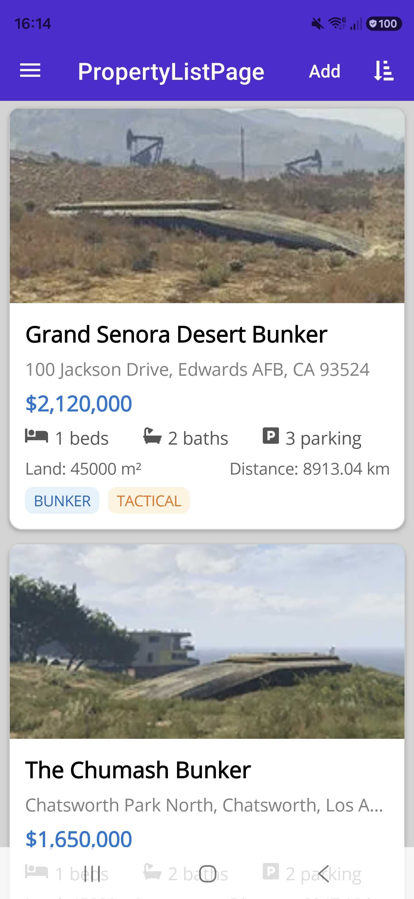
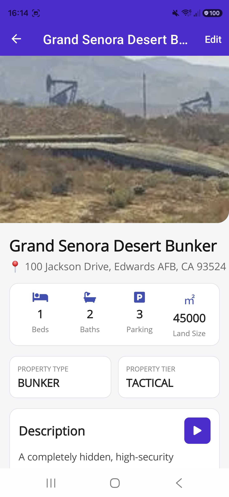
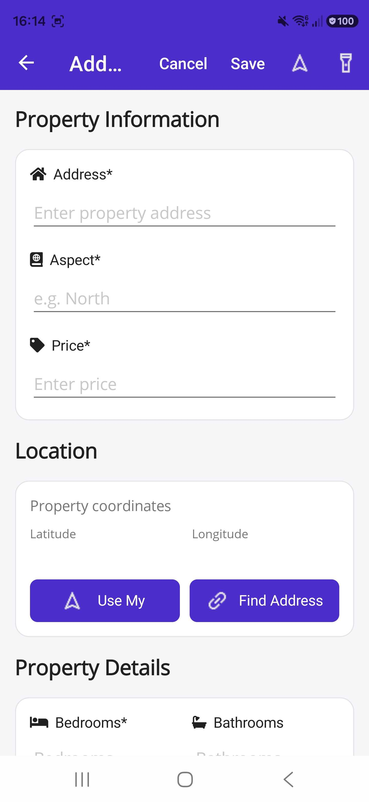
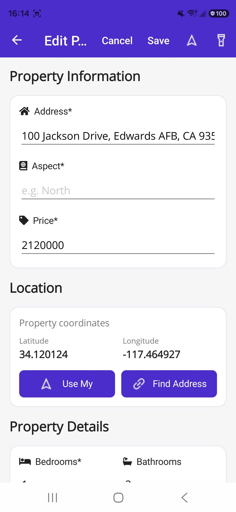
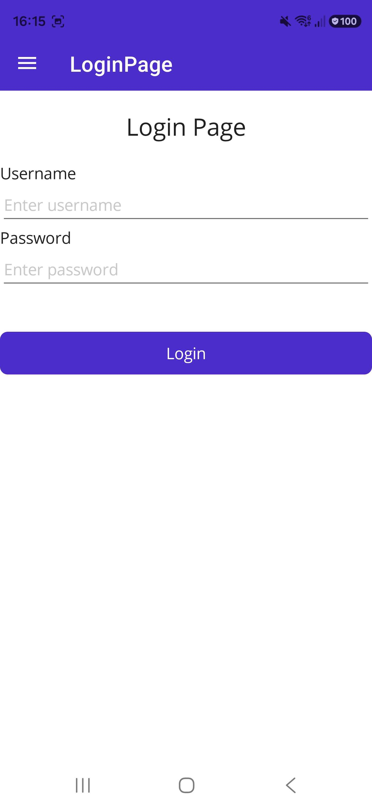
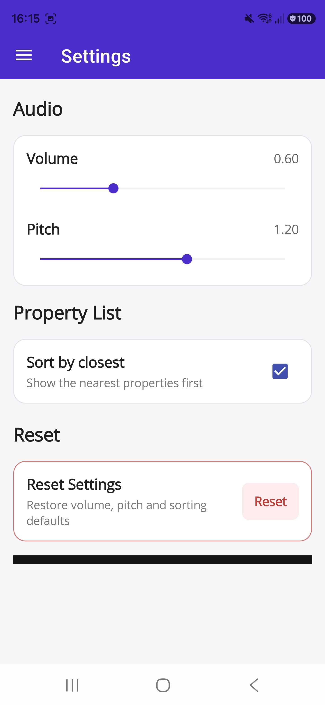
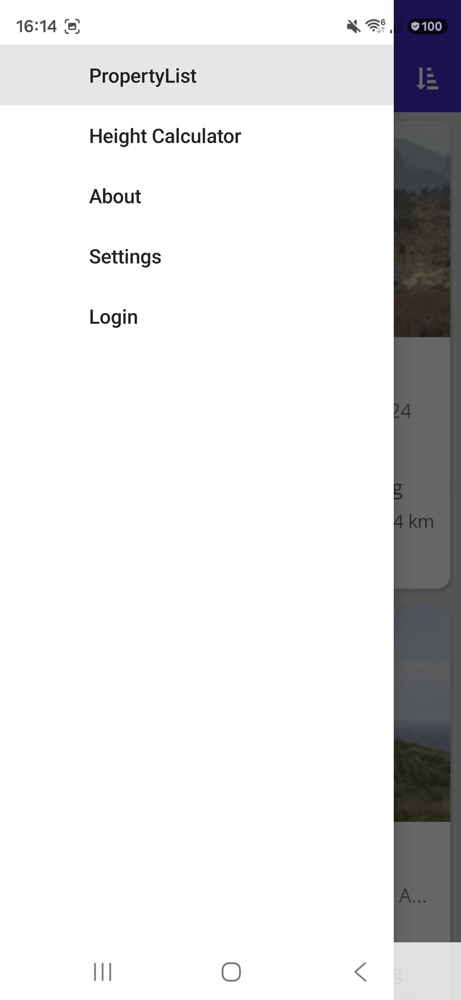
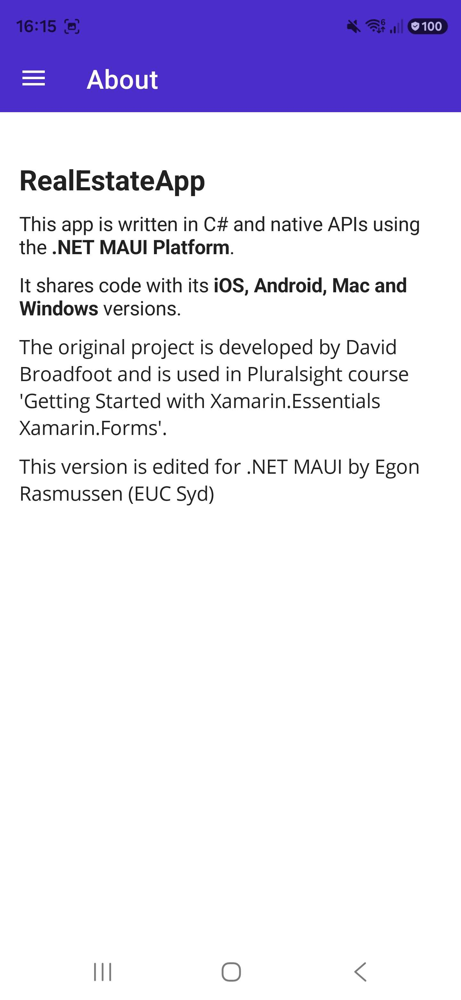
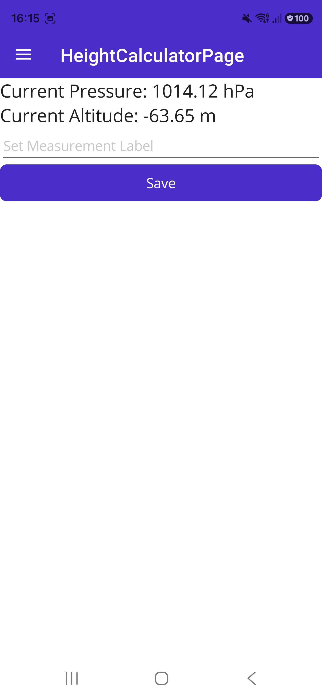

# 🏠 RealEstateApp

A cross-platform real estate application built with **.NET MAUI**, **C#** and **MVVM**.

The app lets users browse properties, view detailed listings, interact with agents, use location-based features and manage property information.

> **Current version:** `V0.8.0`  
> **Development branch:** `develop`

---

## 📸 Screenshots

| Property List | Property Details |
| --- | --- |
|  |  |

| Add Property | Edit Property |
| --- | --- |
|  |  |

| Login | Settings |
| --- | --- |
|  |  |

| Navigation | About |
| --- | --- |
|  |  |

| Height Calculator |
| --- |
|  |

---

## ✨ Features

- 🏘️ Browse and sort property listings
- 🔎 Detailed property information and image galleries
- ➕ Add and edit properties
- 📍 Geolocation, geocoding and distance calculation
- 🗺️ Maps and directions
- 👤 Agent and vendor information
- 📞 Email, SMS and phone contact
- 📤 Property sharing
- 📄 Property contracts
- 🌍 Neighborhood information
- 🔊 Text-to-Speech
- 🔋 Battery and connectivity information
- 📳 Haptics and vibration
- 🔦 Flashlight
- 🧭 Compass and barometer
- 🔐 Login and logout
- ⚙️ Saved application preferences

---

## 🛠️ Tech Stack

| Technology | Purpose |
| --- | --- |
| **C#** | Application language |
| **.NET 10** | Framework |
| **.NET MAUI** | Cross-platform UI |
| **XAML** | User interface |
| **MVVM** | Architecture |
| **.NET MAUI Shell** | Navigation |
| **Dependency Injection** | Service registration |
| **Geolocation / Geocoding** | Location features |
| **Font Awesome** | Icons |
| **Open Sans** | Application font |

### Platforms

- Android
- iOS
- macOS via MacCatalyst
- Windows

---

## 🏗️ Architecture

The project follows **MVVM** with services handling application and data logic.

```text
Views
  ↓
ViewModels
  ↓
Services
  ↓
Models
```

---

💾 Data Storage
The current version uses an in-memory mock repository rather than a database.
```text
IPropertyService
       │
       ▼
MockRepository
       │
       ├── GetProperties()
       ├── GetAgents()
       └── SaveProperty()
```
New properties are added to the in-memory collection, while existing properties are replaced when they share the same ID.
⚠️ Persistence
* Property data changes are currently not persisted between application launches.
* Restarting the application reloads the original mock data.
* The service abstraction allows a future database or API-backed implementation to replace `MockRepository` without requiring the ViewModels to directly depend on a specific storage implementation.
  
---

🧭 Navigation
The application uses .NET MAUI Shell navigation.
The main navigation includes:
🏠 Property List
ℹ️ About
🔐 Login
⚙️ Settings
Additional pages and actions are reached through commands and Shell routes.

```text
Login
  │
  └── Property List
          │
          ├── Select Property
          │       └── Property Details
          │               ├── Edit Property
          │               ├── Contact
          │               ├── Share
          │               ├── Contract
          │               ├── Maps
          │               └── Neighborhood
          │
          └── Add Property

Settings
  │
  └── Saved Preferences

About
```

---

🚀 Getting Started
Prerequisites
You will need:
Visual Studio with .NET MAUI support
.NET 10 SDK
A supported .NET MAUI development environment
An Android emulator, iOS simulator, MacCatalyst environment, Windows machine, or compatible physical device depending on the target platform
Clone the Repository
```bash
git clone https://github.com/Jonasthepanda67/RealEstateApp.git
cd RealEstateApp
```
Open the Project
Open:
```text
RealEstateApp.sln
```
Select your desired target platform and run the application.

---

🖥️ Supported Platforms
The current project configuration targets:
Android
iOS
macOS via MacCatalyst
Windows
Tizen support is present in the project configuration as commented-out code and is not currently enabled.

---

🎯 Current Tasks & Future Plans
[ ] Persistent database storage
[ ] User accounts with a proper backend
[ ] Favorites / saved properties
[ ] Advanced property filtering
[ ] Search functionality
[ ] Interactive in-app map view
[ ] Property image uploading
[ ] Agent/vendor management
[ ] Property deletion
[ ] Property type and tier selection in the add/edit form
[ ] Improved validation
[ ] Offline data persistence

---

🚧 Known Issues
No major known issues are currently documented.
The main architectural limitation is that property data is stored in memory and therefore resets when the application is restarted.

---

🐞 Bug Reporting
Bug reporting is not currently enabled for this project.
If you encounter an issue, feel free to open an issue on GitHub or make your own improvements to the project.

---

🔗 Tags & Links
Versions are based around the version numbers used for the project's pull requests.
Tags are intended to be created after each version has been merged and finalized.
| Version | Pull Request(s) | Tag      |
| ------- | --------------- | -------- |
| V0.1.0  | #1, #2          | `V0.1.0` |
| V0.2.0  | #3, #4          | `V0.2.0` |
| V0.3.0  | #5, #6          | `V0.3.0` |
| V0.4.0  | #7, #8          | `V0.4.0` |
| V0.5.0  | #12             | `V0.5.0` |
| V0.6.0  | #13, #14, #15   | `V0.6.0` |
| V0.7.0  | #16, #17        | `V0.7.0` |
| V0.8.0  | #18, #19        | `V0.8.0` |
> **Current version:** `V0.8.0`  
> The `V0.8.0` tag is prepared above and can be created once the current version is finalized.

---

📜 Changelog
V0.8.0
Added login functionality.
Added logout functionality.
Added persistent Preferences/Settings for user preferences.
Improved styling across multiple pages.
Added and refreshed application screenshots.
Continued improving the application experience around stored user state.
V0.7.0
Added Wikipedia browser functionality for property neighborhoods.
Added functionality for opening property contract files.
Added multiple ways to share property information.
V0.6.0
Added vendor support to properties.
Added vendors to the property details page.
Added email, SMS and phone contact functionality.
Added maps functionality.
Added the ability to open a map for a property.
Added directions functionality.
V0.5.0
Added a barometer feature.
Added the ability to save barometer information.
V0.4.0
Added Text-to-Speech for property descriptions.
Added start/stop controls for Text-to-Speech.
Added battery status functionality.
Added battery-level feedback.
Added flashlight functionality.
V0.3.0
Added connectivity detection.
Added connection-aware UI behaviour.
Disabled or hid location-dependent functionality when a connection is unavailable.
Added haptic feedback.
Added vibration functionality.
V0.2.0
Added current-location retrieval.
Added property distance calculations.
Added property sorting by distance.
Added geocoding functionality.
Added automatic address handling based on the user's current location.
Added multiple location-related quality-of-life improvements.
V0.1.0
Added GTA V-inspired properties and agents.
Added additional property details to the models.
Added the initial real-estate property and agent data foundation.

---

👨‍💻 Author
Jonasthepanda
GitHub: @Jonasthepanda67

---

📄 License
This project does not currently specify a license.
