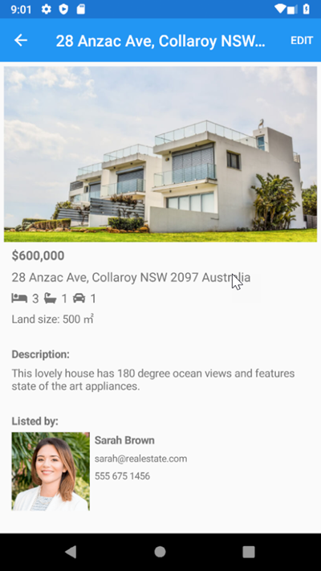
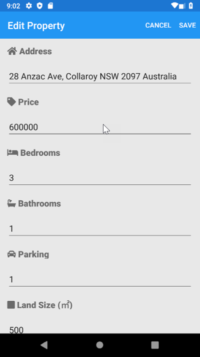
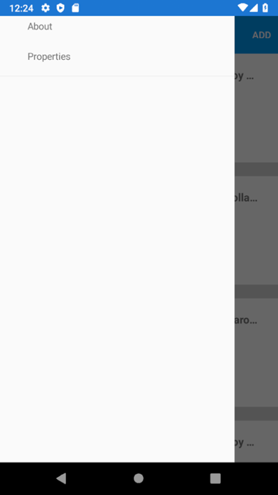

# 🏠 RealEstateApp

A cross-platform real estate application built with **.NET MAUI** and **C#**, using the **MVVM architecture**.

The application allows users to browse a collection of properties, view detailed property information, see associated agents, calculate distances from their current location, and add or edit property listings.

> 🚧 This project currently uses an in-memory mock repository for its data. It is designed as a foundation for future expansion with persistent storage and additional real-estate functionality.

---

## 📱 Screenshots

### Property List


### Property Details



### Add Property


### Edit Property



### Navigation



### About


---

## ✨ Features

### 🏘️ Property Listings

* Browse available properties in a scrollable list.
* View:

  * Property name
  * Address
  * Price
  * Number of bedrooms
  * Number of bathrooms
  * Parking capacity
  * Land size
  * Distance from the user's current location
* Property images are displayed directly in the listing.
* Pull-to-refresh reloads the property collection.
* Sort properties by distance from the user's current location.

### 🔎 Property Details

Selecting a property opens a dedicated details page containing:

* Property image carousel
* Property name
* Price
* Address
* Property type
* Property tier
* Bedrooms
* Bathrooms
* Parking capacity
* Land size
* Description
* Latitude and longitude
* Listing agent information
* Agent image
* Agent specialization

Properties can also be edited directly from the details page.

### ➕ Add & Edit Properties

The application provides a shared form for both creating and editing properties.

Users can enter or modify:

* Address
* Price
* Bedrooms
* Bathrooms
* Parking
* Land size
* Description
* Listing agent
* Location coordinates

The form also includes validation for required fields and provides feedback when required information is missing.

### 📍 Location & Geocoding

The application uses device location services to provide location-aware functionality.

#### Current Location

The property list can retrieve the user's current location and calculate the distance to properties using kilometers.

#### Address Geocoding

When adding or editing a property, an address can be converted into latitude and longitude coordinates.

#### Reverse Geocoding

The application can also retrieve the user's current coordinates and generate an address from the available location information.

---

## 🏢 Property Types

Properties are categorized using the following types:

| Type        |           |
| ----------- | --------- |
| `APARTMENT` | Apartment |
| `PENTHOUSE` | Penthouse |
| `MANSION`   | Mansion   |
| `HOUSE`     | House     |
| `OFFICE`    | Office    |
| `BUNKER`    | Bunker    |
| `CLUBHOUSE` | Clubhouse |
| `NIGHTCLUB` | Nightclub |
| `AUTOSHOP`  | Autoshop  |
| `ARCADE`    | Arcade    |

Properties also have a tier classification:

* `LEGENDARY`
* `PREMIUM`
* `COMMERCIAL`
* `TACTICAL`
* `COMMON`

---

## 🧑‍💼 Real Estate Agents

Properties can be associated with a real estate agent.

Agent information includes:

* Name
* Email
* Phone number
* Description
* Website
* Specialization
* Agent type
* Opening hours
* Agent image

The included sample data contains fictional real-estate businesses such as **Dynasty 8**, **Dynasty 8 Executive**, and **Maze Bank Foreclosures**, with properties based around Los Santos.

---

## 🗂️ Project Structure

The application follows an MVVM-oriented structure:

```text
RealEstateApp/
│
├── Converters/
│
├── Helpers/
│
├── Models/
│   ├── Agent.cs
│   ├── Property.cs
│   ├── PropertyImage.cs
│   ├── PropertyListItem.cs
│   ├── PropertyTier.cs
│   └── PropertyType.cs
│
├── Platforms/
│   ├── Android/
│   ├── iOS/
│   ├── MacCatalyst/
│   ├── Tizen/
│   └── Windows/
│
├── Properties/
│
├── Resources/
│   ├── AppIcon/
│   ├── Fonts/
│   ├── Images/
│   ├── Raw/
│   ├── Splash/
│   └── Styles/
│
├── Services/
│   ├── IPropertyService.cs
│   └── MockRepository.cs
│
├── ViewModels/
│   ├── AddEditPropertyPageViewModel.cs
│   ├── BaseViewModel.cs
│   ├── PropertyDetailPageViewModel.cs
│   └── PropertyListPageViewModel.cs
│
├── Views/
│   ├── AboutPage.xaml
│   ├── AddEditPropertyPage.xaml
│   ├── PropertyDetailPage.xaml
│   └── PropertyListPage.xaml
│
├── App.xaml
├── AppShell.xaml
├── GlobalSettings.cs
├── MauiProgram.cs
└── RealEstateApp.csproj
```

---

## 🧱 Architecture

The application is structured around **MVVM (Model-View-ViewModel)**.

### Models

The model layer contains the application's core data structures, including:

* `Property`
* `Agent`
* `PropertyImage`
* `PropertyListItem`
* `PropertyType`
* `PropertyTier`

A `Property` contains information such as its price, address, description, property type, tier, bedrooms, bathrooms, parking, land size, agent ID, images, and geographic coordinates.

### Views

The UI is implemented using **XAML** pages:

* `PropertyListPage`
* `PropertyDetailPage`
* `AddEditPropertyPage`
* `AboutPage`

### ViewModels

The ViewModels contain the application's presentation logic and commands.

For example:

* `PropertyListPageViewModel`

  * Loads properties
  * Handles pull-to-refresh
  * Retrieves user location
  * Calculates property distances
  * Sorts properties
  * Handles navigation

* `PropertyDetailPageViewModel`

  * Loads selected property information
  * Finds the associated agent
  * Builds the property image carousel
  * Handles navigation to editing

* `AddEditPropertyPageViewModel`

  * Handles creating and editing properties
  * Validates required fields
  * Handles agent selection
  * Handles location retrieval
  * Handles address geocoding
  * Saves properties

---

## 💾 Data Storage

The current version uses a **mock repository** rather than a database.

`MockRepository` implements `IPropertyService` and initially loads the sample properties and agents into memory.

```text
IPropertyService
       │
       ▼
MockRepository
       │
       ├── GetProperties()
       ├── GetAgents()
       └── SaveProperty()
```

New properties are added to the in-memory collection, while existing properties are replaced when they share the same ID.

### ⚠️ Persistence

Changes are currently **not persisted between application launches**.

Restarting the application reloads the original mock data.

A future database-backed implementation could replace `MockRepository` without requiring the ViewModels to depend directly on a specific storage implementation.

---

## 🧭 Navigation

The application uses **.NET MAUI Shell navigation**.

Current main navigation consists of:

* 🏠 **Property List**
* ℹ️ **About**

Additional pages are reached through commands and Shell routes:

```text
Property List
    │
    ├── Select Property
    │       └── Property Details
    │               └── Edit Property
    │
    └── Add
            └── Add Property
```

---

## 🛠️ Tech Stack

| Technology               | Usage                              |
| ------------------------ | ---------------------------------- |
| **C#**                   | Application language               |
| **.NET 10**              | Runtime / framework                |
| **.NET MAUI**            | Cross-platform UI framework        |
| **XAML**                 | User interface definitions         |
| **MVVM**                 | Application architecture           |
| **Dependency Injection** | Service and ViewModel registration |
| **.NET MAUI Shell**      | Navigation                         |
| **Geolocation**          | Current device location            |
| **Geocoding**            | Address ↔ coordinate conversion    |
| **Font Awesome**         | UI icons                           |
| **Open Sans**            | Application font                   |

The project currently targets:

* Android
* iOS
* macOS via Mac Catalyst
* Windows

A Tizen target is present in the project configuration as commented-out support.

---

## 🚀 Getting Started

### Prerequisites

You will need:

* Visual Studio with .NET MAUI support
* .NET 10 SDK
* A supported .NET MAUI development environment
* An emulator, simulator, or physical device for your target platform

### Clone the Repository

```bash
git clone https://github.com/Jonasthepanda67/RealEstateApp.git
cd RealEstateApp
```

### Open the Project

Open the solution:

```text
RealEstateApp.sln
```

From there, select your desired target platform and run the application.

---

## 🖥️ Supported Platforms

The project is configured for:

```text
Android
iOS
MacCatalyst
Windows
```

---

## 🗺️ Location Permissions

Because the application can retrieve the user's current location, the selected platform may require location permissions.

Location functionality is used for:

* Calculating distances between the user and properties
* Retrieving the user's current coordinates
* Reverse geocoding coordinates into an address

---

## 📸 Property Images

Property images are included as application resources and are associated with properties through their image URLs.

The project also contains an MSBuild target that automatically generates a property image catalog during compilation by scanning the application's image resources.

---

## 🎯 Future Improvements

The current architecture leaves room for several possible improvements:

* [ ] Persistent database storage
* [ ] Cloud/API-backed property listings
* [ ] User accounts
* [ ] Favorites / saved properties
* [ ] Advanced property filtering
* [ ] Search functionality
* [ ] Interactive map view
* [ ] Property image uploading
* [ ] Agent contact functionality
* [ ] Property deletion
* [ ] Property type and tier selection in the add/edit form
* [ ] Improved validation
* [ ] Offline data persistence
* [ ] Additional platform-specific functionality

---

## 📚 What This Project Demonstrates

This project was built as a practical example of working with:

* .NET MAUI
* MVVM architecture
* XAML data binding
* `ObservableCollection`
* `ICommand` / MAUI `Command`
* Dependency Injection
* Shell navigation
* Query properties
* Geolocation APIs
* Geocoding APIs
* Cross-platform application development
* Reusable service abstractions
* In-memory data repositories
* Responsive mobile UI design

---

## 👨‍💻 Author

**Jonasthepanda**

GitHub: [@Jonasthepanda67](https://github.com/Jonasthepanda67)

---

## 📄 License

This project does not currently specify a license.

If you intend to make the project open source, consider adding a license such as the MIT License.
